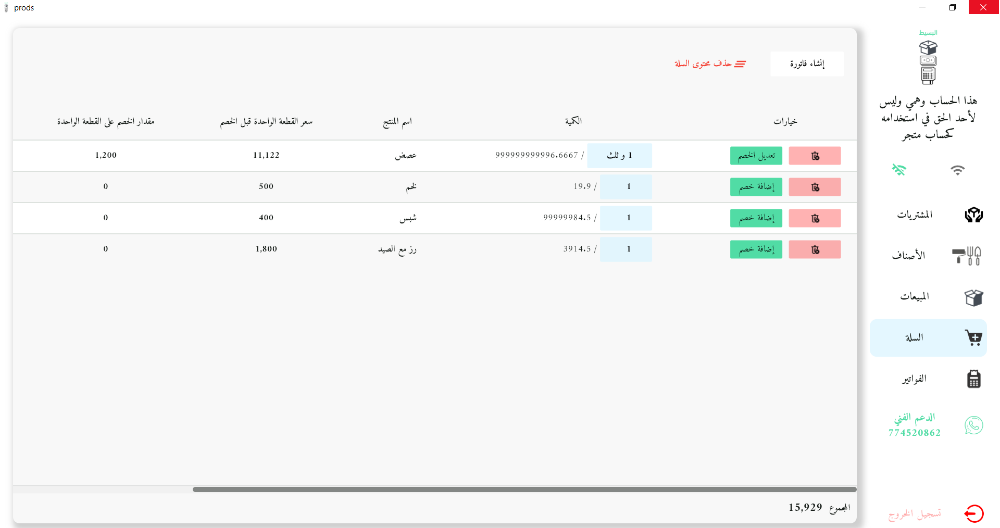
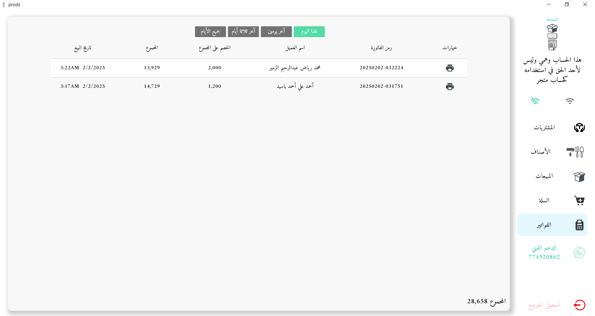

## وصف البرنامج
### برنامج دسكتوب اسمه "البسيط" لأنه يحتوي على العمليات الأساسية لكل محل،، في العادة لما يشتري صاحب المحل برنامج يكون فيه مئات النوافذ والتخصيصات ف يضيع في البرنامج،، أما هذا البرنامج فقد شمل العمليات الأساسية البسيطة لكل محل 

## تعليمات تثبيت ملف exe
الحساب التجريبي لتشغيل البرنامج

البريد الالكتروني التجريبي
***
test@mrz.com

كلمة المرور
***
12345678

عند تثبيت نسخة الكمبيوتر بيطلب كلمة سر وهي
***
albasset123

رابط تثبيت النسخة
***
https://github.com/mrzM7md/prods/tree/master/exe%20release

### الشرح بالصور

#### 1- تسجيل الدخول

#### 2- صفحة المشتريات

#### 3- إضافة عملية شراء جديدة

#### 4- فلترة عمليات الشراء بالوقت

#### 5- عند الضغط على إنشاء فاتورة سيتم عرض الفاتورة بهذا الشكل

#### 6- صفحة ألأصناف

#### 7- إضافة أو تعديل صنف

#### 8- حذف صنف

#### 9- صفحة المبيعات

#### 10- تعديل أو إضافة مبيعات

#### 11- صفحة السلة

#### 12- تكملة صفحة السلة

#### 13- الضغط على زر إنشاء فاتورة

#### 14- عند الضغط على زر إنشاء فاتورة ستظهر الفاتورة بهذا الشكل

#### 16- صفحة الفواتير
